# Sahan Pramuditha Portfolio

[](https://reactjs.org/)
[](https://vitejs.dev/)
[](https://tailwindcss.com/)

Interactive personal portfolio built with React, Vite, Tailwind CSS, Framer Motion, and Three.js.

## Live

- Production: https://www.sahanpramuditha.me

## Screenshots

A visual tour of the portfolio experience, including the hero section, projects, 3D interactions, services, and contact flow.

| Hero & CTA | Projects | About & Stats | 3D Experiences |
| --- | --- | --- | --- |
| 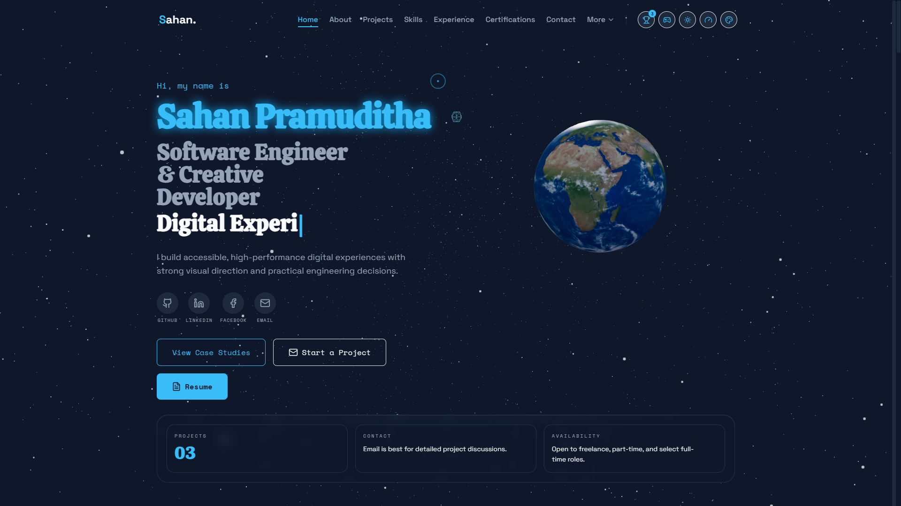 | 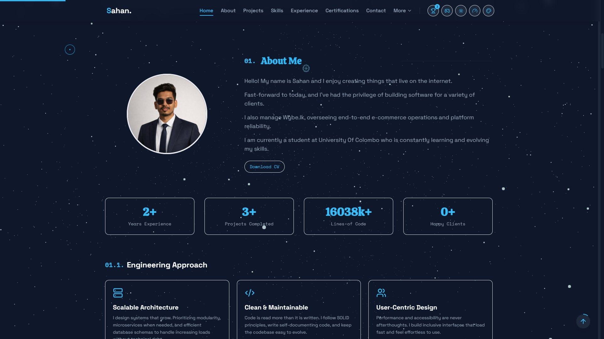 | 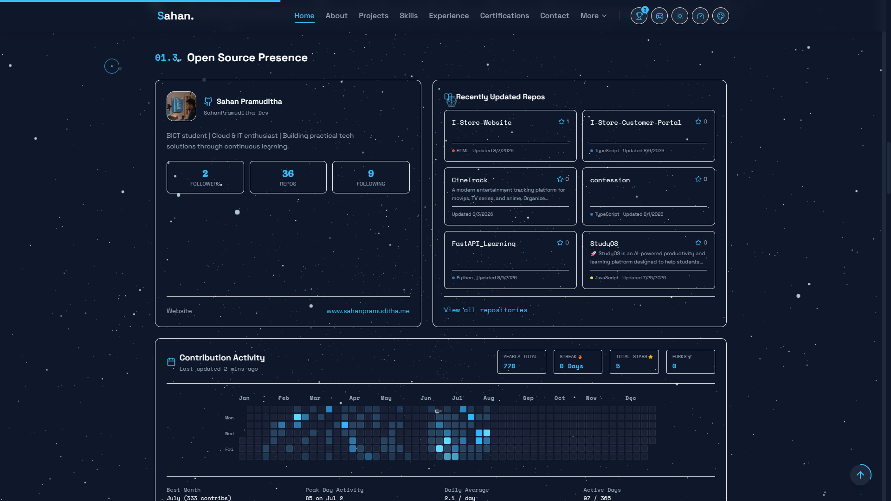 | 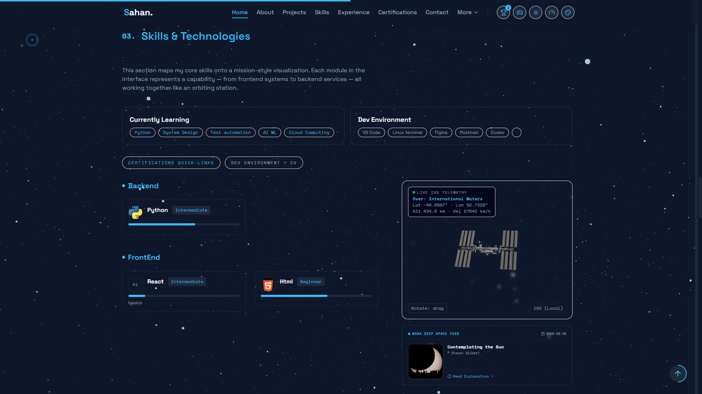 |
| Home hero and CTA | Project list and case studies | About + experience stats | Interactive 3D canvas preview |
| | | | |
| 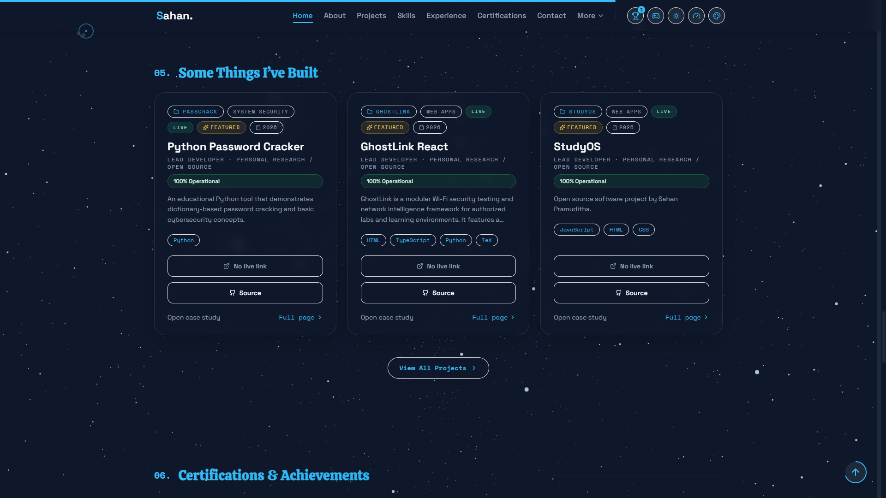 | 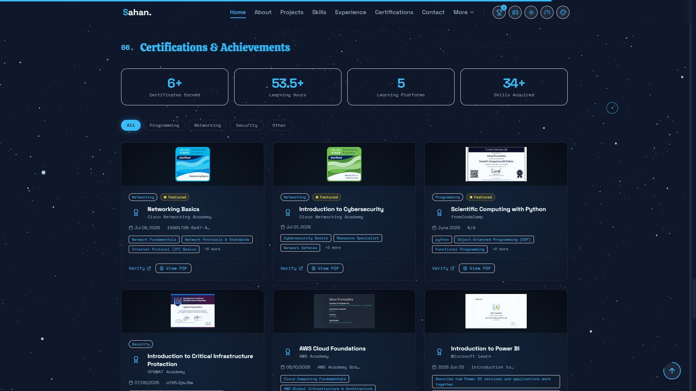 | 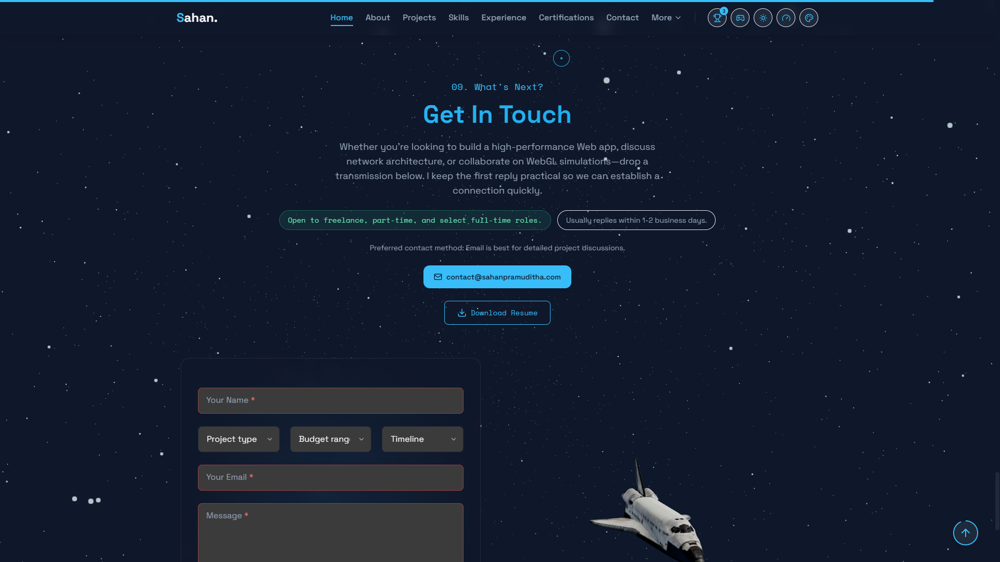 | 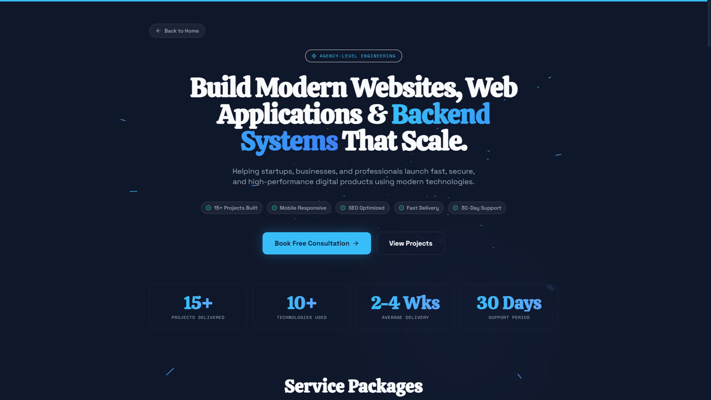 |
| Resume preview and download | Service cards and ordering flow | Contact form and booking CTA | Command palette and hotkeys |
| | | | |
| 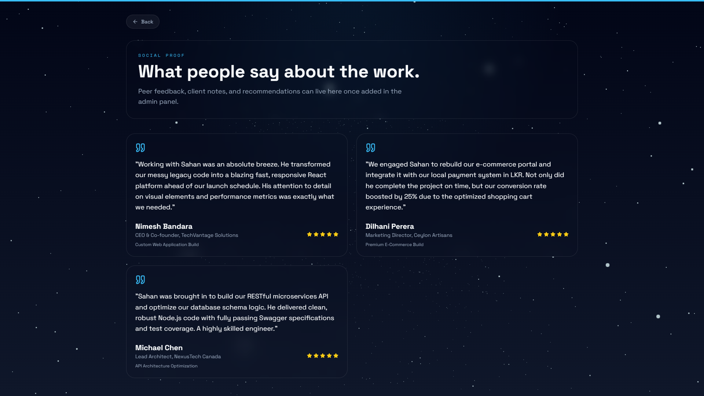 | 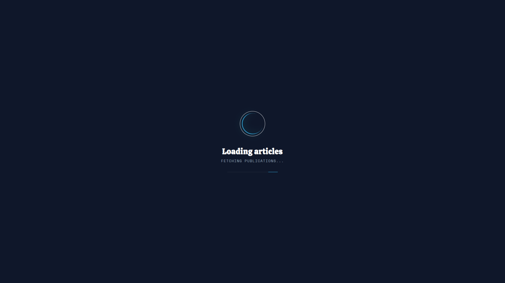 | 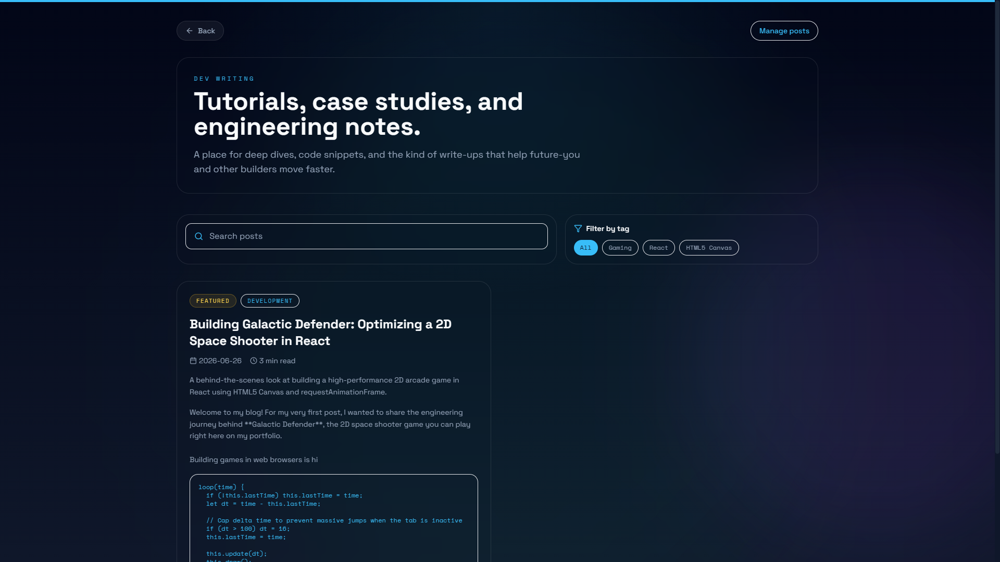 | 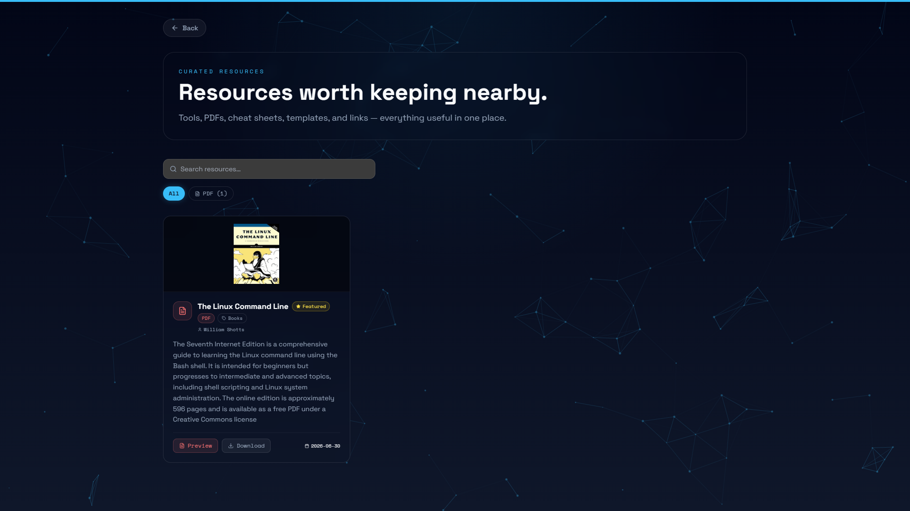 |
| Blog, testimonials, and dynamic content | SEO + metadata preview | Theme and accent controls | Responsive mobile layout |
| 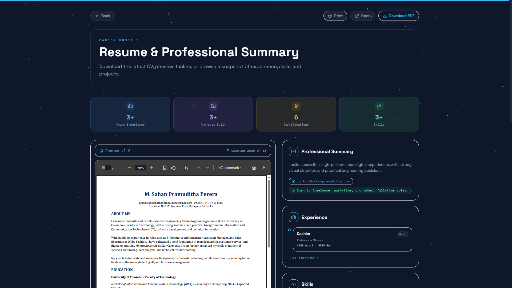 | | | |
| Launch checklist / project highlights | | | |

## Features

- Smooth single-page sections with scroll progress and scroll-to-top.
- Interactive 3D experiences (Three.js and React Three Fiber).
- ISS preview with Sketchfab primary embed and local GLB fallback.
- Theme accent color picker with persistent selection.
- Keyboard shortcuts, command palette (`Ctrl/Cmd + K`), and skip-to-content support.
- Project case-study pages with shareable `/projects/:slug` URLs.
- Now/availability section powered by CMS content.
- SEO metadata, Open Graph tags, and JSON-LD structured data.
- Contact form with endpoint support, Formspree support, and mailto fallback.
- Optional analytics hooks for custom endpoint, GA4, and Plausible.
- Konami-code easter egg that opens a mini snake game.

## 🚀 Recent Updates

- **Preloader Redesign** (v2): Nebula canvas background with stars, orbiting rocket/planet loader, holographic SVG progress ring, glitch text reveals, particle bursts, enhanced neon glows and space theme (preserves ~2s duration).
- **Code Quality Clean-up** (v2.0.1): Fixed all 40 ESLint warnings and errors across React files (including conditional hook errors, impure ref state initializations, case declarations leaking variables, and unused imports) to establish a warning-free `npm run lint` pipeline.
- **Resume Page Immersive Redesign** (v2.1): Integrated animated numerical counters (years of experience, project build counts, skills count), taller PDF preview frames with "Open" and "Download" options, interactive work experience timelines, grouped category skill chips, and a glowing Call-to-Action (CTA) section.
- **Homepage Services Integration** (v2.2): Integrated scoped service cards on the homepage with custom icons, LKR pricing, typical timelines, turnaround slots, checklists, and dynamic "Select Base Template" options that prefill the Contact Form and auto-scroll to the contact section with automated URL query state cleanups.
- **Testimonials & OSS Seed** (v2.3): Seeded professional client testimonials and dynamic open-source repository displays. All project card click hooks now direct users to SEO-friendly full-page case studies instead of modals.

## Tech Stack

- React ^19.2.0
- Vite ^7.2.4
- Tailwind CSS 3
- Framer Motion
- GSAP
- Three.js + @react-three/fiber + @react-three/drei
- Lucide React

## Requirements

- Node.js `^20.19.0 || >=22.12.0` (required by Vite 7)
- npm 10+

## Quick Start

```bash
npm install
cp .env.example .env
npm run dev
```

PowerShell alternative:

```powershell
Copy-Item .env.example .env
```

Open the local URL printed by Vite (usually `http://localhost:5173`).

## Scripts

```bash
npm run dev      # start local dev server
npm run generate:sitemap # rebuild public/sitemap.xml
npm run build    # production build to dist/
npm run preview  # preview production build locally
npm run lint     # run eslint
```

`npm run build` runs the sitemap generator first. To include CMS project/blog URLs, add `public/cms-sitemap.json` or `sitemap.dynamic.json` with `projects` and `blog` arrays containing `slug`, `title`, `id`, or `missionCode` fields.

## Environment Variables

Create a `.env` file from `.env.example`.

| Variable | Required | Purpose |
| --- | --- | --- |
| `VITE_RESUME_URL` | No | External resume URL. If empty, app uses `/resume.pdf`. |
| `VITE_CONTACT_ENDPOINT` | No | Full POST endpoint for contact form submissions. |
| `VITE_FORMSPREE_ID` | No | Formspree form ID (used if `VITE_CONTACT_ENDPOINT` is not set). |
| `VITE_BOOKING_URL` | No | Optional booking/calendar link shown in contact and services CTAs. |
| `VITE_GITHUB_TOKEN` | No | GitHub token to reduce API rate-limit issues for GitHub stats. |
| `VITE_ANALYTICS_ENDPOINT` | No | Custom analytics ingestion endpoint. |
| `VITE_SITE_URL` | No | Canonical production site URL used by SEO metadata. |
| `VITE_FIREBASE_*` | No | Firebase CMS config. Defaults are included for this portfolio instance. |

## Project Structure

```text
.
|-- public/
|   |-- models/iss/               # local GLB fallback model
|   |-- robots.txt
|   |-- sitemap.xml
|   `-- site.webmanifest
|-- src/
|   |-- components/               # UI sections, effects, and 3D components
|   |-- config/                   # earth and model config
|   |-- context/                  # theme context
|   `-- utils/analytics.js
|-- EARTH_TUNING_GUIDE.md         # earth visual tuning guide
|-- LAUNCH_CHECKLIST.md           # release checklist for GitHub/public launch
`-- README.md
```

## Customization Guide

- Profile and hero text: `src/components/Hero.jsx`
- About and experience content: `src/components/About.jsx`, `src/components/Experience.jsx`
- Skills and 3D model behavior: `src/components/Skills.jsx`, `src/config/modelConfig.js`
- Projects list: `src/components/Projects.jsx`
- Certifications: `src/components/Certifications.jsx`
- Contact behavior: `src/components/Contact.jsx`
- SEO/meta tags: `src/components/SEO.jsx`, `src/components/StructuredData.jsx`
- Earth scene tuning: `src/config/earthConfig.js` and `EARTH_TUNING_GUIDE.md`

## Deployment

This app outputs static files to `dist/` and works on:

- Vercel
- Netlify
- Cloudflare Pages
- GitHub Pages (with Vite base-path setup if hosted in a subpath)

Standard deploy command:

```bash
npm run build
```

## Launch Checklist

Before making the repository public, complete `LAUNCH_CHECKLIST.md`.

## GitHub Community Docs

- `CONTRIBUTING.md`
- `CODE_OF_CONDUCT.md`
- `SECURITY.md`
- `.github/ISSUE_TEMPLATE/`
- `.github/pull_request_template.md`

## License

This project is licensed under the MIT License. See `LICENSE`.
